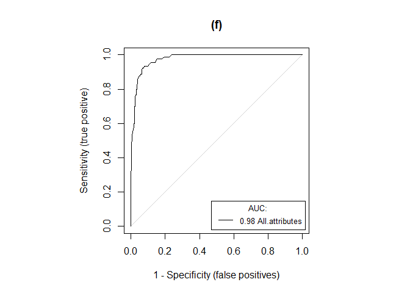
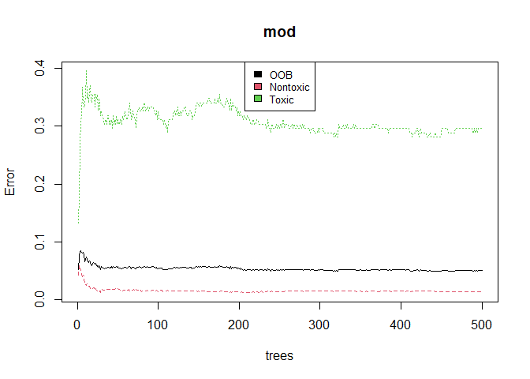
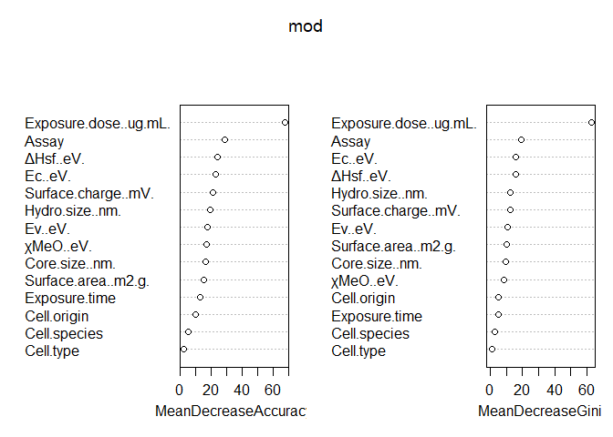
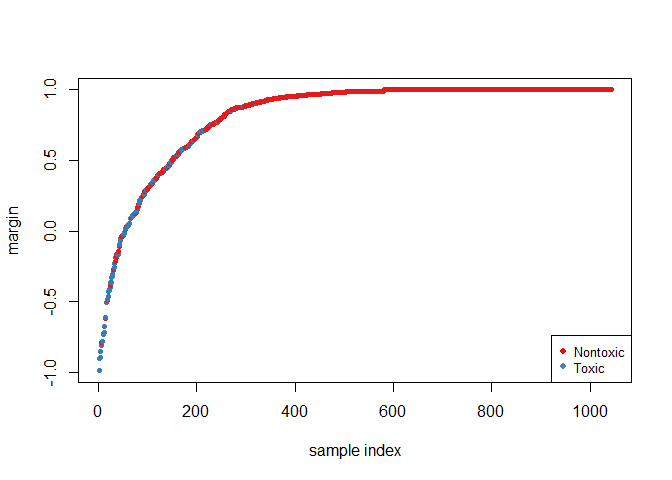

Toxicity Classifier(Random Forest)
================

### The example data sets

We use data sets from Ha et al. Sci. Rep. (2018). Datasets contain
several properties of oxide nanoparticles, such as physicochemical,
toxicological and quantum-mechanical properties.

### Preprocessing of the toxicity Data

Before execute read.xlxs, make sure that place the excel file in the
current R path.

##### Read Dataset sheet III as DataFrame object

``` r
library(openxlsx) 
score_org <- read.xlsx("../data/Datasets.xlsx", sheet = 3, colNames = TRUE) 
```

##### Convert character values into factor values

``` r
for (i in c(15:19,23)) { 
  score_org[,i] <- as.factor(score_org[,i])
} 
rm(i)
```

##### Normalize numeric data

data.Normalization is function for normalizing numeric data. ‘n1’ type
means standardization.

``` r
preObj <- score_org[,c(3,5,7,9,11:14,20,21)] 
preObj$Exposure.time <- gsub('h', '', preObj$Exposure.time)
preObj$Exposure.time <- as.numeric(preObj$Exposure.time)
library(clusterSim)
preObj <- data.Normalization(preObj, type = "n1", normalization = "column")
```

##### Combine normalized numeric data with factor data

``` r
score.pre <- data.frame(preObj, score_org[,c(15,17:19,23)])
str(score.pre)
```

    ## 'data.frame':    1738 obs. of  15 variables:
    ##  $ Core.size..nm.       : num  -0.0738 -0.0738 -0.0738 -0.0738 -0.0738 ...
    ##  $ Hydro.size..nm.      : num  -0.0471 -0.0471 -0.0471 -0.0471 -0.0471 ...
    ##  $ Surface.charge..mV.  : num  1.11 1.11 1.11 1.11 1.11 ...
    ##  $ Surface.area..m2.g.  : num  -0.0665 -0.0665 -0.0665 -0.0665 -0.0665 ...
    ##  $ ΔHsf..eV.           : num  -1.61 -1.61 -1.61 -1.61 -1.61 ...
    ##  $ Ec..eV.              : num  1.81 1.81 1.81 1.81 1.81 ...
    ##  $ Ev..eV.              : num  -1.38 -1.38 -1.38 -1.38 -1.38 ...
    ##  $ χMeO..eV.           : num  -0.196 -0.196 -0.196 -0.196 -0.196 ...
    ##  $ Exposure.time        : num  -0.0524 -0.0524 -0.0524 -0.0524 -0.0524 ...
    ##  $ Exposure.dose..ug.mL.: num  -0.385 -0.385 -0.384 -0.379 -0.355 ...
    ##  $ Assay                : Factor w/ 16 levels "Alamar blue",..: 12 12 12 12 12 12 12 12 12 12 ...
    ##  $ Cell.species         : Factor w/ 3 levels "Hamster","Human",..: 2 2 2 2 2 2 2 2 2 2 ...
    ##  $ Cell.origin          : Factor w/ 11 levels "Adipose tissue",..: 3 3 3 3 3 3 3 3 3 3 ...
    ##  $ Cell.type            : Factor w/ 2 levels "Cancer","Normal": 2 2 2 2 2 2 2 2 2 2 ...
    ##  $ Toxicity             : Factor w/ 2 levels "Nontoxic","Toxic": 1 1 1 1 1 1 1 1 1 1 ...

##### Split data into training and test sets

createDataPartition function does startified sampling. We will divide
the dataset into 60% training set for training the Random Forest model
and 40% test set for testing the trained model.

``` r
library(caret)
inTrain <- createDataPartition(y = score.pre$Toxicity, p = 0.6, list = FALSE) 
train <- score.pre[inTrain,] 
test <- score.pre[-inTrain,] 
```

### Implementation and evaluation

Apply the randomForest function on the training set to make a random
forest model that can predict toxicity.

``` r
library(randomForest)
mod <- randomForest(Toxicity ~ ., data = train, importance = T, proximity = T)
```

Apply the randomForest function on the test set to evaluate toxicity
prediction performance of the trained model.

``` r
pred <- predict(mod, test) 
pred.prob <-predict(mod, test, type="prob") 
```

##### Make a confusion matrix

``` r
table(test$Toxicity, pred) 
```

    ##           pred
    ##            Nontoxic Toxic
    ##   Nontoxic      591    14
    ##   Toxic          26    64

##### Caculate accuracy and F1 Score

The F1 score is the harmonic mean of the precision and recall. In
statistical analysis of binary classification, F1 score is a measure of
a test’s accuracy.

``` r
(accuracy <- sum(pred==test$Toxicity) / nrow(test) * 100) 
```

    ## [1] 94.2446

``` r
precision <- sum(pred == "Nontoxic" & test$Toxicity == "Nontoxic") / sum(pred == "Nontoxic")
sensitivity <- sum(pred == "Nontoxic" & test$Toxicity == "Nontoxic") / sum(test$Toxicity=="Nontoxic")
(F1 <- 2*(precision*sensitivity)/(precision + sensitivity))
```

    ## [1] 0.9672668

###### Build ROC plot & calculate AUC

AUC - ROC curve is a performance measurement for classification problem
at various thresholds settings. ROC is a probability curve and AUC
represents degree or measure of separability. It tells how much model is
capable of distinguishing between classes. Higher the AUC, better the
model is at predicting 0s as 0s and 1s as 1s. Higher the AUC, better the
model is at distinguishing between nanoparticle with toxicity and
non-toxicity.  
The ROC curve is plotted with TPR against the FPR where TPR is on y-axis
and FPR is on the x-axis.

``` r
library(PresenceAbsence)
score_org$prob <- ifelse(score_org$Toxicity == "Nontoxic",0,1) 
ObsPred <- data.frame(Material=score_org[-inTrain,]$Material.type, 
                      Probability=score_org[-inTrain,]$prob, 
                      Prediction=pred.prob[,2]) 

auc.roc.plot(ObsPred, which.model = 1, model.names = "All.attributes", 
             color = FALSE, line.type = "solid", threshold = 101, 
             xlab = "1 - Specificity (false positives)", 
             ylab = "Sensitivity (true positive)", main = "(f)", 
             find.auc = TRUE, opt.thresholds = FALSE, opt.methods = 9)
```

<!-- -->

##### Plot error rate as the number of tree increase

``` r
plot(mod) 
legend("top", colnames(mod$err.rate), col = 1:3, cex = 0.8, fill = 1:3) 
```

<!-- -->

###### value important

``` r
importance(mod) 
```

    ##                        Nontoxic      Toxic MeanDecreaseAccuracy
    ## Core.size..nm.        13.663559 11.1919961            16.356749
    ## Hydro.size..nm.       14.633907 14.5875851            19.303670
    ## Surface.charge..mV.   14.366921 17.8553734            21.054719
    ## Surface.area..m2.g.   12.535305 11.1770561            15.356504
    ## ΔHsf..eV.            17.711964 23.9287234            23.922212
    ## Ec..eV.               18.674033 23.6813133            23.173666
    ## Ev..eV.               12.757610 17.1338242            17.512346
    ## χMeO..eV.            12.110501 14.9151545            17.053925
    ## Exposure.time         12.534117  3.4603975            13.071939
    ## Exposure.dose..ug.mL. 52.675005 61.2994133            67.654641
    ## Assay                 24.915487 15.1009885            28.652059
    ## Cell.species           1.991799  5.8021488             5.372276
    ## Cell.origin            9.001793  5.4424611            10.153421
    ## Cell.type              2.802910  0.3554866             2.446620
    ##                       MeanDecreaseGini
    ## Core.size..nm.                9.306171
    ## Hydro.size..nm.              12.499627
    ## Surface.charge..mV.          12.373382
    ## Surface.area..m2.g.           9.938216
    ## ΔHsf..eV.                   15.553439
    ## Ec..eV.                      16.034650
    ## Ev..eV.                      10.627085
    ## χMeO..eV.                    8.598418
    ## Exposure.time                 4.812889
    ## Exposure.dose..ug.mL.        62.888490
    ## Assay                        19.351882
    ## Cell.species                  2.634261
    ## Cell.origin                   4.908826
    ## Cell.type                     1.227315

``` r
varImpPlot(mod) 
```

<!-- -->

##### margin graph

The margin of a data point is defined as the proportion of votes for the
correct class minus maximum proportion of votes for the other classes.
Thus under majority votes, positive margin means correct classification,
and vice versa.

``` r
plot(margin(mod, train$Toxicity), xlab= "sample index", ylab="margin") 
legend("bottomright", levels(as.factor(attributes(margin(mod, train_4$Toxicity))$names)), col = c("red", "steelblue"), cex=0.8, pch=16)
```

<!-- -->

### References

  - My Kieu Ha (2018). Toxicity Classification of Oxide Nanomaterials:
    Effects of Data Gap Filling and PChem Score-based Screening
    Approaches. Sci Rep 8, 3141. <doi:10.1038/s41598-018-21431-9>
