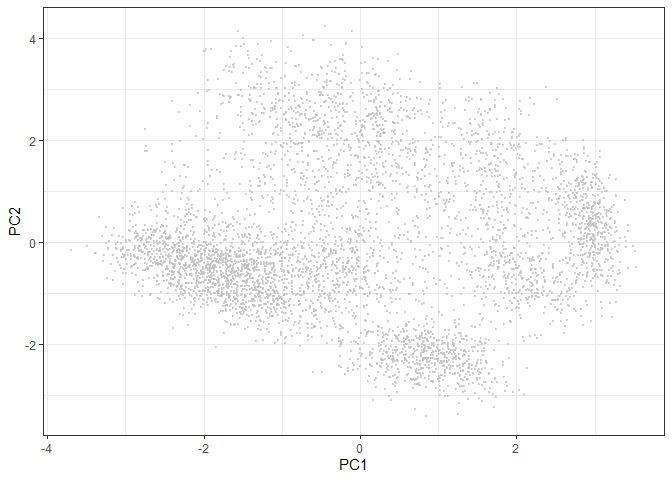
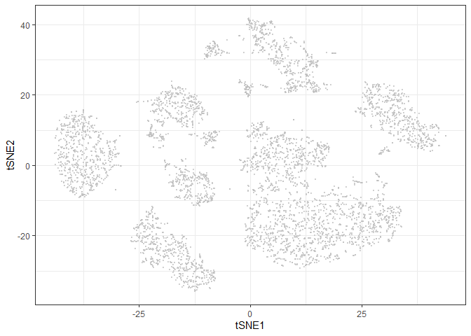
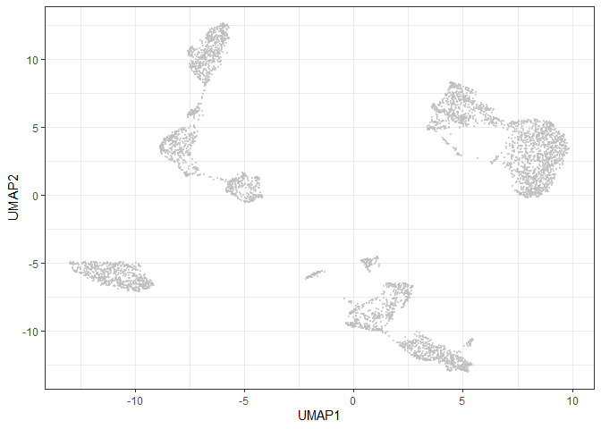
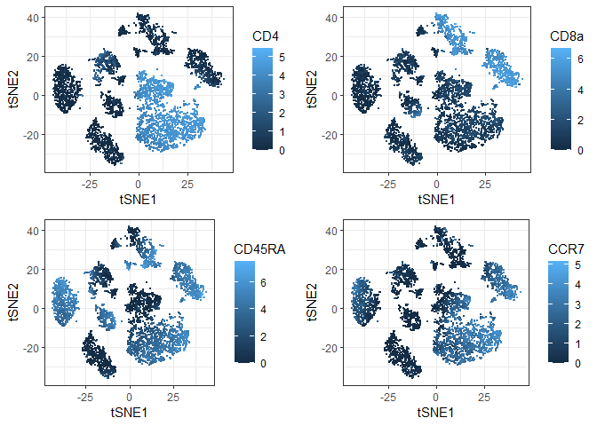
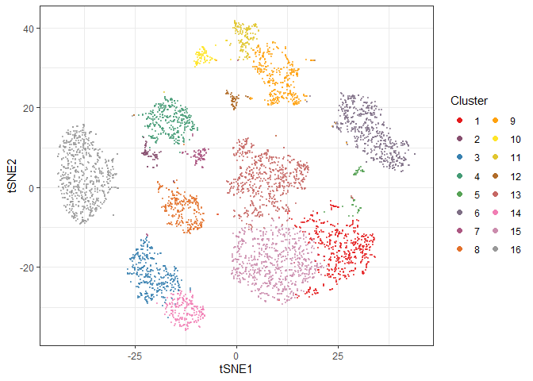

CyTOF Data Analysis
================

### The example data sets

We use a of CyTOF data from Environmental Science:Nano Paper, My et
al.2020. There are mass cytometry data for 7 human PBMC samples treated 
with Ag nanopariticle.We use a leukocyte sample which are manually gated 
and concatenated in FlowJo Software.  

The original data is available from the link below.  
<https://drive.google.com/drive/u/0/folders/1hD8bfT8z-9y8lGRDH0sTb_Jn12xw0S4X>

### Data preprocessing

##### Read fcs file

The FCS format is a binary data file standard originally developed for
storage of flow cytometry data. As well as the ion count matrix, it has
slots for experiment information, channel information, etc. It is
recommended that you set the current path using setwd() in console and
put the file in that directory.

``` r
library(flowCore)
fcs <- read.FCS(filename="../data/Leukocytes.fcs", transformation=F, truncate_max_range = F)
```

##### Extract expression matrix

``` r
exprs <- fcs@exprs
head(exprs)
```

    ##      107Ag_Silver 109Ag_Silver2 140Ce_EQ_bead 142Ce_EQ_bead 142Nd_CD11a
    ## [1,]      2.09535       5.13235       0.00000     24.110500   23.815201
    ## [2,]      2.64842      14.74470       2.94295     50.124599   49.871700
    ## [3,]      3.73653       2.96752       1.00217     19.460100   20.030399
    ## [4,]      2.31900       1.61281       0.00000    127.204002  126.718002
    ## [5,]      1.85461       4.56292       0.00000      0.980765    0.520483
    ## [6,]     23.55660      31.90190       2.94880     55.363400   54.583801
    ##       145Nd_CD4 146Nd_CD8a 148Nd_CD16 150Nd_pSTAT5 151Eu_EQ_bead
    ## [1,]  14.721000  760.11298    0.30062     0.000000             0
    ## [2,] 209.348999    9.58157    7.39743     2.925350             0
    ## [3,]   0.421023    6.86555  284.58899     3.989510             0
    ## [4,]   3.444430  828.90198    7.38029     3.158400             0
    ## [5,]   0.000000    4.13091    1.04378     0.498559             0
    ## [6,] 389.881989   27.07150   12.35900     8.595690             0
    ##      152Sm_a-Cleaved_Cas7 153Eu_pSTAT1 154Sm_CD45 156Gd_p38 158Gd_pSTAT3
    ## [1,]             0.000000    0.0000000   351.8290  8.113280      4.59629
    ## [2,]             0.000000    0.0000000   844.4740 12.702300      4.84200
    ## [3,]             0.818599    0.6123940    70.6705  0.000000      0.00000
    ## [4,]             0.188295    0.0786945  1412.3400 14.870200      1.99288
    ## [5,]             1.111760    0.0000000   514.7640  0.736715      0.00000
    ## [6,]             2.212910    0.0000000  1898.4100 15.854800      0.00000
    ##      159Tb_CCR7 161Dy_a-pp-BAD_Ser112_ 164Dy_IkBa 165Ho_CD45RO 166Er_CD44
    ## [1,]  47.730598               0.000000    17.9505     0.661812    10.2329
    ## [2,]  14.169800               1.962310    23.5747   142.598007    91.6422
    ## [3,]   0.000000               0.000000    16.4435    25.895599     7.7707
    ## [4,]   0.891568               0.753408     7.7749   570.960022   322.3280
    ## [5,]  21.365299               0.217193    13.7463     0.000000   148.0490
    ## [6,] 113.636002               4.948190    71.4679    65.134499   343.8020
    ##      169Tm_CD45RA  170Er_CD3 171Yb_pERK1-2 174Yb_HLA-DR 175Lu_pS6 176Lu_EQ_bead
    ## [1,]    317.69000  88.012299     0.0000000     0.000000  1.645160       0.00000
    ## [2,]      0.00000 216.774002     0.0000000     0.580389  2.888840       0.00000
    ## [3,]      5.27192   0.198414     0.0000000     0.000000  0.000000       0.00000
    ## [4,]      2.04707 469.641998     0.0000000     0.601964  0.000000       0.00000
    ## [5,]    598.58197   4.757690     0.0688194   615.559998  5.003260       1.78281
    ## [6,]    392.16199 485.645996     0.0000000     0.000000  0.995776       0.00000
    ##      191Ir_DNA1 193Ir_DNA2 195Pt_Live  Center Contol5000 DownsampleDP
    ## [1,]    829.968    1458.61    7.31138 516.343  -0.500000    -0.500000
    ## [2,]    731.154    1448.40   17.25630 546.502   0.500002     0.500002
    ## [3,]    786.380    1379.72   26.94190 487.012  -0.499800    -0.499800
    ## [4,]    788.826    1500.13   13.43020 676.921   0.500202     0.500202
    ## [5,]    633.908    1239.46    7.08621 604.818  -0.499400    -0.499400
    ## [6,]   1574.010    2736.32   23.75620 706.222   0.500602     0.500602
    ##      Event_length  Offset Residual       Time
    ## [1,]           14  76.455   83.592 0.00308511
    ## [2,]           15  67.988  123.124 0.01149110
    ## [3,]           14  90.048   94.832 0.42952499
    ## [4,]           17  67.617   95.469 0.43511599
    ## [5,]           17  69.074  100.888 1.60259998
    ## [6,]           19 127.433  182.044 1.61161995

##### Explore the parameters

fcs file also contains metadata, such as the expression range of each
channel.

``` r
fcs@parameters@data
```

    ##                        name                                         desc range
    ## $P1            107Ag_Silver                                 107Ag_Silver 24244
    ## $P2           109Ag_Silver2                                109Ag_Silver2 24021
    ## $P3           140Ce_EQ_bead                                140Ce_EQ_bead 12280
    ## $P4           142Ce_EQ_bead                                142Ce_EQ_bead  2239
    ## $P5             142Nd_CD11a                                  142Nd_CD11a  2238
    ## $P6               145Nd_CD4                                    145Nd_CD4  1243
    ## $P7              146Nd_CD8a                                   146Nd_CD8a  2568
    ## $P8              148Nd_CD16                                   148Nd_CD16  1687
    ## $P9            150Nd_pSTAT5                                 150Nd_pSTAT5 26987
    ## $P10          151Eu_EQ_bead                                151Eu_EQ_bead 12463
    ## $P11   152Sm_a-Cleaved_Cas7                         152Sm_a-Cleaved_Cas7  6719
    ## $P12           153Eu_pSTAT1                                 153Eu_pSTAT1   580
    ## $P13             154Sm_CD45                                   154Sm_CD45  5563
    ## $P14              156Gd_p38                                    156Gd_p38  5885
    ## $P15           158Gd_pSTAT3                                 158Gd_pSTAT3  9545
    ## $P16             159Tb_CCR7                                   159Tb_CCR7   709
    ## $P17 161Dy_a-pp-BAD_Ser112_                       161Dy_a-pp-BAD_Ser112_   183
    ## $P18             164Dy_IkBa                                   164Dy_IkBa  1650
    ## $P19           165Ho_CD45RO                                 165Ho_CD45RO 13319
    ## $P20             166Er_CD44                                   166Er_CD44  5933
    ## $P21           169Tm_CD45RA                                 169Tm_CD45RA  8212
    ## $P22              170Er_CD3                                    170Er_CD3  1897
    ## $P23          171Yb_pERK1-2                                171Yb_pERK1-2  1857
    ## $P24           174Yb_HLA-DR                                 174Yb_HLA-DR  5194
    ## $P25              175Lu_pS6                                    175Lu_pS6 13589
    ## $P26          176Lu_EQ_bead                                176Lu_EQ_bead   328
    ## $P27             191Ir_DNA1                                   191Ir_DNA1 11795
    ## $P28             193Ir_DNA2                                   193Ir_DNA2 18922
    ## $P29             195Pt_Live                                   195Pt_Live 17211
    ## $P30                 Center                                       Center   200
    ## $P31             Contol5000 (Event #%100) - 0.5 + (Event #/(500000 + 1))  1000
    ## $P32           DownsampleDP  (Event #%50) - 0.5 + (Event #/(500000 + 1))  1000
    ## $P33           Event_length                                 Event_length    64
    ## $P34                 Offset                                       Offset   200
    ## $P35               Residual                                     Residual   200
    ## $P36                   Time                                         Time  3293
    ##      minRange maxRange
    ## $P1       0.0    24243
    ## $P2       0.0    24020
    ## $P3       0.0    12279
    ## $P4       0.0     2238
    ## $P5       0.0     2237
    ## $P6       0.0     1242
    ## $P7       0.0     2567
    ## $P8       0.0     1686
    ## $P9       0.0    26986
    ## $P10      0.0    12462
    ## $P11      0.0     6718
    ## $P12      0.0      579
    ## $P13      0.0     5562
    ## $P14      0.0     5884
    ## $P15      0.0     9544
    ## $P16      0.0      708
    ## $P17      0.0      182
    ## $P18      0.0     1649
    ## $P19      0.0    13318
    ## $P20      0.0     5932
    ## $P21      0.0     8211
    ## $P22      0.0     1896
    ## $P23      0.0     1856
    ## $P24      0.0     5193
    ## $P25      0.0    13588
    ## $P26      0.0      327
    ## $P27      0.0    11794
    ## $P28      0.0    18921
    ## $P29      0.0    17210
    ## $P30      0.0      199
    ## $P31     -0.5      999
    ## $P32     -0.5      999
    ## $P33      0.0       63
    ## $P34      0.0      199
    ## $P35      0.0      199
    ## $P36      0.0     3292

Make name of columns human readable using information in the parameter
data slot

``` r
markers <- gsub(pattern = "_$", replacement = "", x = as.vector(fcs@parameters@data$desc))
markers <- gsub(pattern = ".*_", replacement = "", x = markers)
markers <- gsub(pattern = "-", replacement = ".", x = markers)
colnames(exprs) <- markers
surface_markers <- c("CD3", "CD4", "CD8a", "CD11a", "CD16", "CD44", "CD45RA", "CD45RO", "HLA.DR", "CCR7")
```

##### Data transformation

Mass cytometry data is usuallly ArcSinh transformed. This transformation
will retain linearity in the low end of the count spectrum, but it
resembles a log transformation in the high end. Transformations are done
primarily for visualization purposes

``` r
cofactor <- 5
exprs[, surface_markers] <- asinh(exprs[, surface_markers] / cofactor)
```

### Dimensionality Reduction

##### PCA

For mass cytometry data, a PCA will often capture 40-50% of the variance
on the first 2-3 PCs, but since the distance between events is linear,
data existing on a nonlinear manifold will be misrepresented (Chester &
Maecker et al., 2015).

``` r
pca <- prcomp(exprs[, surface_markers], scale. = TRUE)
library(ggplot2)
ggplot(as.data.frame(pca$x), aes(x = PC1, y = PC2)) + 
  geom_point(color = "grey", alpha = 0.6, size = 0.5) + 
  theme_bw() 
```

<!-- -->

##### t-SNE

The t-Distributed Stochastic Neighbor Embedding (t-SNE) dimensionality
reduction algorithm is a popular tool for dimensionality reduction of
cytometry data (van der Maaten and Hinton et al., 2008).  
Before running t-SNE, it is necessary to remove identical events (if
any) from the sample (duplicate rows).We set a seed for get reproducible
results.

``` r
library(Rtsne)
table(duplicated(exprs[, surface_markers]))
```

    ## 
    ## FALSE 
    ##  5000

``` r
exprs <- exprs[!duplicated(exprs[, surface_markers]), ]
set.seed(42)
tsne <- Rtsne(exprs[, surface_markers])
ggplot(as.data.frame(tsne$Y), aes(x = V1, y = V2)) +
  geom_point(color = "grey", alpha = 0.6, size = 0.5) +
  xlab('tSNE1') + ylab('tSNE2') +
  theme_bw()
```

<!-- -->

##### UMAP

UMAP works in a dimensionality reduction method that is more similar to
t-SNE than PCA. However, it has several advantages over t-SNE. The first
one is speed. For a small dataset there may not be a significant
difference, bu you will surely notice it for a million cells.
Furthermore, UMAP preserves global distances in the data a lot better
than t-SNE. We set a seed for get reproducible results.

``` r
library(uwot)
umap <- umap(exprs[, surface_markers], min_dist = 0.2)
ggplot(as.data.frame(umap), aes(x = V1, y = V2)) +
  geom_point(color = "grey", alpha = 0.6, size = 0.5) +
  xlab('UMAP1') + ylab('UMAP2') +
  theme_bw()
```

<!-- -->

##### Visualize tSNE plot with several marker intensities

``` r
library(reshape2) 
library(cowplot) 
obj <- cbind.data.frame(exprs, tsne$Y) 
colnames(obj)[(ncol(obj)-1):ncol(obj)] <- c('tSNE1', 'tSNE2') 
colnames(obj) <- make.unique(names(obj))
p <- list() 
for (c in c("CD4", "CD8a", "CD45RA", "CCR7")) { 
  p[[c]] <- ggplot(obj, aes(x = tSNE1, y = tSNE2)) + 
    geom_point(aes_string(color = c), size = 0.5) + 
    theme_bw() 
} 
plot_grid(plotlist = p, ncol = 2) 
```

<!-- -->

### Clustering

##### Phenograph

Phenograph is an algorithm which directly assigns single cells to a
particular cluster while taking the all measured dimensions into
account. Phenograph employs a k-nearest neighbor graph (k-NNG), in which
each cell is a node that is connected to its nearest neighbors by edges,
to cluster cells into phenotypically similar groups - cellular
populations. Phenograph also requires removal of duplicates.  
Phenograph is implemented in the R package “cytofkit”.

``` r
library(cytofkit) 
clusters_pg <- cytof_cluster(xdata = exprs[,surface_markers], method = "Rphenograph") 
```

    ##   Running PhenoGraph...  Finding nearest neighbors...DONE ~ 0.19 s
    ##   Compute jaccard coefficient between nearest-neighbor sets...DONE ~ 1.73 s
    ##   Build undirected graph from the weighted links...DONE ~ 0.7 s
    ##   Run louvain clustering on the graph ...DONE ~ 0.36 s
    ##   Return a community class
    ##   -Modularity value: 0.881426 
    ##   -Number of clusters: 16 DONE!

It is a vector that contains the number of clusters of entire cell.

``` r
head(clusters_pg)
```

    ## [1]  6 13  3 11 16  1

##### Visualize phenograph results on tSNE

``` r
library(RColorBrewer)
getPalette = colorRampPalette(brewer.pal(9, "Set1")) 
cols <- getPalette(max(clusters_pg)) 
plot_df <- cbind.data.frame(obj, clusters_pg) 
plot_df$clusters_pg <-as.factor(plot_df$clusters_pg) 
ggplot(plot_df, aes(x = tSNE1, y = tSNE2)) + 
  geom_point(aes(color = clusters_pg), alpha = 0.6, size = 0.5) + 
  guides(colour = guide_legend(override.aes = list(alpha = 1, size = 2), 
                               ncol = 2, title = 'Cluster')) + 
  scale_color_manual(values = cols) + 
  theme_bw() 
```

<!-- -->

### References

  - My Kieu Ha (2020). Mass cytometric study on the heterogeneity in
    cellular association and cytotoxicity of silver nanoparticles in
    primary human immune cells. Environmental Science:Nano, 2020,7,
    1102-1114. <doi:10.1039/C9EN01104H>
  - Data scientist’s primer to analysis of mass cytometry data, The
    Cancer Omics Group,
    <https://biosurf.org/cytof_data_scientist.html#1_preamble>
