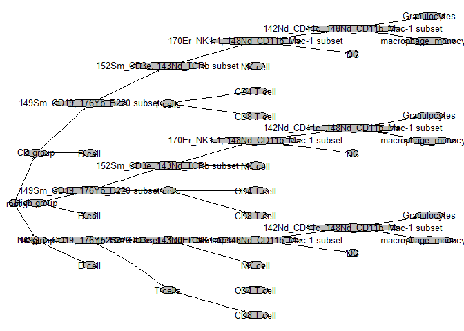

Importing gating informations and assigning cell type to clusters
================

# Import gating information

### Import gating information from cytobank

With gatingML file and related fcs files, you can get the gatingset
object with CytoML

``` r
library(flowWorkspace)
library(CytoML)
library(flowCore)

#full path of gatingML and fcsfile 
xmlfile <- "../data/CytExp_337288_Gates_v6.xml"
fcsfile <- "../data/2019 1 29  Control_Leukocyte.fcs"
#Get gatingset object from gatingML file and fcs file.
gs <- cytobank_to_gatingset(xmlfile, fcsfile)
#Get gated flow data from gatingset
fs <-  gs_pop_get_data(gs)
```

Also, you can get the populations of gated cell type and gating
hierarchy

``` r
# Extract the population statistics
gs_pop_get_count_fast(gs, statType = "count")
```

    ##                                 name
    ##  1: 2019 1 29  Control_Leukocyte.fcs
    ##  2: 2019 1 29  Control_Leukocyte.fcs
    ##  3: 2019 1 29  Control_Leukocyte.fcs
    ##  4: 2019 1 29  Control_Leukocyte.fcs
    ##  5: 2019 1 29  Control_Leukocyte.fcs
    ##  6: 2019 1 29  Control_Leukocyte.fcs
    ##  7: 2019 1 29  Control_Leukocyte.fcs
    ##  8: 2019 1 29  Control_Leukocyte.fcs
    ##  9: 2019 1 29  Control_Leukocyte.fcs
    ## 10: 2019 1 29  Control_Leukocyte.fcs
    ## 11: 2019 1 29  Control_Leukocyte.fcs
    ## 12: 2019 1 29  Control_Leukocyte.fcs
    ## 13: 2019 1 29  Control_Leukocyte.fcs
    ## 14: 2019 1 29  Control_Leukocyte.fcs
    ## 15: 2019 1 29  Control_Leukocyte.fcs
    ## 16: 2019 1 29  Control_Leukocyte.fcs
    ## 17: 2019 1 29  Control_Leukocyte.fcs
    ## 18: 2019 1 29  Control_Leukocyte.fcs
    ## 19: 2019 1 29  Control_Leukocyte.fcs
    ## 20: 2019 1 29  Control_Leukocyte.fcs
    ##                                            Population
    ##  1:                                      /Non T cells
    ##  2:                                  /Non T cells/B-1
    ##  3:                              /Non T cells/B-1/B-2
    ##  4:                      /Non T cells/B-1/B-2/B cells
    ##  5:                                  /Non T cells/M-1
    ##  6:                              /Non T cells/M-1/M-2
    ##  7:                    /Non T cells/M-1/M-2/Monocytes
    ##  8:                                 /Non T cells/NK-1
    ##  9:                        /Non T cells/NK-1/NK cells
    ## 10:                                  /Non T cells/D-1
    ## 11:                  /Non T cells/D-1/Dendritic cells
    ## 12:                                          /T cells
    ## 13:                                      /T cells/T-2
    ## 14:                                  /T cells/T-2/T-3
    ## 15:                     /T cells/T-2/T-3/CD8+ T cells
    ## 16: /T cells/T-2/T-3/CD8+ T cells/Memory CD8+ T cells
    ## 17:  /T cells/T-2/T-3/CD8+ T cells/Naive CD8+ T cells
    ## 18:                     /T cells/T-2/T-3/CD4+ T cells
    ## 19:  /T cells/T-2/T-3/CD4+ T cells/Naive CD4+ T cells
    ## 20: /T cells/T-2/T-3/CD4+ T cells/Memory CD4+ T cells
    ##                            Parent  Count ParentCount
    ##  1:                          root  81704      195003
    ##  2:                  /Non T cells  51477       81704
    ##  3:              /Non T cells/B-1  21634       51477
    ##  4:          /Non T cells/B-1/B-2  16278       21634
    ##  5:                  /Non T cells  27887       81704
    ##  6:              /Non T cells/M-1  18830       27887
    ##  7:          /Non T cells/M-1/M-2  17490       18830
    ##  8:                  /Non T cells  39594       81704
    ##  9:             /Non T cells/NK-1  14630       39594
    ## 10:                  /Non T cells  37187       81704
    ## 11:              /Non T cells/D-1   3170       37187
    ## 12:                          root 110927      195003
    ## 13:                      /T cells 103849      110927
    ## 14:                  /T cells/T-2 103561      103849
    ## 15:              /T cells/T-2/T-3  19093      103561
    ## 16: /T cells/T-2/T-3/CD8+ T cells   1121       19093
    ## 17: /T cells/T-2/T-3/CD8+ T cells  16232       19093
    ## 18:              /T cells/T-2/T-3  71985      103561
    ## 19: /T cells/T-2/T-3/CD4+ T cells  47548       71985
    ## 20: /T cells/T-2/T-3/CD4+ T cells  13006       71985

``` r
plot(gs)
```

<!-- -->

### Import Gating information from cytobank

With Flowjo workspace file and related fcs files, you can get the
gatingset object with CytoML. Both files must be in the same directory.

``` r
#Import Flowjo workssace
ws <- open_flowjo_xml("../data/concat_leukocytes.wsp")
gs <- flowjo_to_gatingset(ws, name=1)
#Get gated flow data from gatingset
fs <- gs_pop_get_data(gs)
```

When importing gating information, CytoML transforms several channels in
flow data which are used in gating as they are written in gating
information file. To treat all channels equally, we have to transform
flow data inversely and make it raw data.

``` r
# Inverse transformation
trans.inv <- gh_get_transformations(gs[[1]], inverse = TRUE) 
translist <- transformList(names(trans.inv), trans.inv)
fs.raw <- transform(fs, translist)
# Extract expression matrix from flow data 
exprs <- exprs(fs.raw[[1]])
exprs <- as.data.frame(exprs)
```

##### Change marker name easy to read

``` r
(params <- parameters(fs.raw[[1]])@data)
```

    ##              name               desc      range      minRange   maxRange
    ## $P1      SampleID               <NA> 262143.000  0.000000e+00 262143.000
    ## $P2       Ce140Di        140Ce_Bead1   8190.998 -5.512851e-08   8190.998
    ## $P3        Center               <NA>   8190.998 -5.512851e-08   8190.998
    ## $P4       Dy162Di         162Dy_Ly6c   8190.998 -5.512851e-08   8190.998
    ## $P5       Er168Di         168Er_CD8a   4095.000 -5.512851e-08   4095.000
    ## $P6       Er170Di        170Er_NK1.1   4095.000 -5.512851e-08   4095.000
    ## $P7       Eu151Di         151Eu_CD25   8190.998 -5.512851e-08   8190.998
    ## $P8       Eu153Di        153Eu_Bead2   8190.998 -5.512851e-08   8190.998
    ## $P9  Event_length               <NA>   4095.000 -5.512851e-08   4095.000
    ## $P10      Gd160Di        160Gd_CD62L   4095.000 -5.512851e-08   4095.000
    ## $P11      Ho165Di        165Ho_Bead3   8190.998 -5.512851e-08   8190.998
    ## $P12      Ir191Di         191Ir_DNA1   8190.998 -5.512851e-08   8190.998
    ## $P13      Ir193Di         193Ir_DNA2  11999.001 -5.512851e-08  11999.001
    ## $P14      Lu175Di        175Lu_Bead4   8190.998 -5.512851e-08   8190.998
    ## $P15      Nd142Di        142Nd_CD11c   4095.000 -5.512851e-08   4095.000
    ## $P16      Nd143Di         143Nd_TCRb  11999.001 -5.512851e-08  11999.001
    ## $P17      Nd145Di         145Nd_CD69   4095.000 -5.512851e-08   4095.000
    ## $P18      Nd148Di  148Nd_CD11b_Mac-1   4095.000 -5.512851e-08   4095.000
    ## $P19       Offset               <NA>   4095.000 -5.512851e-08   4095.000
    ## $P20      Pd102Di          102Pd_BC1   8190.998 -5.512851e-08   8190.998
    ## $P21      Pd104Di          104Pd_BC2   4095.000 -5.512851e-08   4095.000
    ## $P22      Pd105Di          105Pd_BC3   4095.000 -5.512851e-08   4095.000
    ## $P23      Pd106Di          106Pd_BC4   4095.000 -5.512851e-08   4095.000
    ## $P24      Pd108Di          108Pd_BC5   8190.998 -5.512851e-08   8190.998
    ## $P25      Pd110Di          110Pd_BC6   4095.000 -5.512851e-08   4095.000
    ## $P26      Pr141Di 141Pr_Ly-6G_C_Gr-1  11999.001 -5.512851e-08  11999.001
    ## $P27      Pt195Di    195Pt_Viability  11999.001 -5.512851e-08  11999.001
    ## $P28     Residual               <NA>   4095.000 -5.512851e-08   4095.000
    ## $P29      Sm147Di         147Sm_CD45   4095.000 -5.512851e-08   4095.000
    ## $P30      Sm149Di         149Sm_CD19   4095.000 -5.512851e-08   4095.000
    ## $P31      Sm152Di         152Sm_CD3e   4095.000 -5.512851e-08   4095.000
    ## $P32      Sm154Di      154Sm_TER-119   4095.000 -5.512851e-08   4095.000
    ## $P33      Tb159Di        159Tb_F4_80   4095.000 -5.512851e-08   4095.000
    ## $P34      Tm169Di        169Tm_CD206   4095.000 -5.512851e-08   4095.000
    ## $P35      Yb171Di         171Yb_CD44  11999.001 -5.512851e-08  11999.001
    ## $P36      Yb172Di          172Yb_CD4   8190.998 -5.512851e-08   8190.998
    ## $P37      Yb176Di         176Yb_B220   4095.000 -5.512851e-08   4095.000
    ## $P38         Time               <NA>  11070.146  0.000000e+00  11070.146

Depending on the fcs file, the name of the channel can vary. It would be
good process to change channel names by referring to description of
parameter and make it easy to read.

``` r
#Convert Marker names by referring to description of parameter  
for(i in colnames(exprs)){
  
  if(i %in% params[,1]){
    colnames(exprs)[colnames(exprs)==i] <- params[params$name==i,2]
  }
}
#Remove channles without description 
exprs <- exprs[,!is.na(colnames(exprs))] 
#Leave the name of target antibody only
colnames(exprs) <- gsub(pattern = "^[0-9]*", replacement ="",x=colnames(exprs))
colnames(exprs) <- gsub(pattern = "-", replacement =".",x=colnames(exprs))
colnames(exprs) <- gsub(pattern = "_$", replacement ="",x=colnames(exprs))
colnames(exprs) <- gsub(pattern = ".*_", replacement ="",x=colnames(exprs))
colnames(exprs) <- make.unique(colnames(exprs),sep = "_")
```

##### Annotating sample condtion and manually gated cell type

In this sample, sample condition nodes have depth 1 and cell type nodes
are leaf node at the tree of gating hierarchy.

To annotate these conditions, we use ‘gh\_pop\_get\_indices’ function
that returns a logical vector that describes each event in a sample is
included by certain gate.

``` r
#Plot gating hierarchy
plot(gs,fontsize=30)
```

<!-- -->

We can annotate sample condition by selecting nodes which have depth 1
and using ‘gh\_pop\_get\_indices’ function.

``` r
#Annotate Sample names
exprs["sample"] <- rep("NA",nrow(exprs))
path <- gs_get_pop_paths(gs)
for(i in 1:length(path)){
  split_path <- strsplit(path[i],"/")
  if(length(split_path[[1]])==2){
    exprs[gh_pop_get_indices(gs,path[i]),"sample"] <- split_path[[1]][2]
  }
}
```

We can annotate cell type by selecting leaf nodes without child node and
using ‘gh\_pop\_get\_indices’ function. The cells that are not included
in leaf nodes are annotated as ‘ungated’

``` r
#Annotate cell types
exprs["celltype"] <- rep("ungated",nrow(exprs))
exprs["node"] <- rep("ungated",nrow(exprs))
for(i in gs_get_leaf_nodes(gs)){
  #i <- gsub(".*/", "", i)
  cellType <- gsub(".*/", "", i)
  exprs[gh_pop_get_indices(gs,i),"celltype"] <- cellType
  exprs[gh_pop_get_indices(gs,i),"node"] <- i
}
```

``` r
table(exprs[,"sample"],exprs[,"celltype"])
```

    ##             
    ##              B cell CD4 T cell CD8 T cell    DC Granulocytes
    ##   CD group    83422      29253      13192  1077           67
    ##   High group  94092      33949      14825  2681         5272
    ##   NA              0          0          0     0            0
    ##   NC group    39562      15946       4127   160           11
    ##             
    ##              macrophage_monocytes NK cell ungated
    ##   CD group                   1463    7668   15246
    ##   High group                 4661    7134   20028
    ##   NA                            0       0     131
    ##   NC group                    650    2096   10567

To treat easily, conver these character values to factor values

``` r
exprs[,c("celltype","node","sample")] <- lapply(exprs[,c("celltype","node","sample")], as.factor)
str(exprs)
```

    ## 'data.frame':    407280 obs. of  35 variables:
    ##  $ Bead1    : num  1.04e-01 1.01e-01 -5.51e-08 1.88 -5.51e-08 ...
    ##  $ Ly6c     : num  -5.51e-08 1.80e+03 -5.51e-08 -5.51e-08 -5.51e-08 ...
    ##  $ CD8a     : num  -5.51e-08 1.36e+02 -5.51e-08 -5.51e-08 -5.51e-08 ...
    ##  $ NK1.1    : num  1.11e-01 -5.51e-08 -5.51e-08 -5.51e-08 -5.51e-08 ...
    ##  $ CD25     : num  2.12e-01 -5.51e-08 -5.51e-08 -5.51e-08 9.23e-01 ...
    ##  $ Bead2    : num  -5.51e-08 -5.51e-08 -5.51e-08 -5.51e-08 2.20e-01 ...
    ##  $ CD62L    : num  -5.51e-08 4.45e+01 8.59 -5.51e-08 2.33e+01 ...
    ##  $ Bead3    : num  -5.51e-08 -5.51e-08 -5.51e-08 -5.51e-08 -5.51e-08 ...
    ##  $ DNA1     : num  1045 853 971 797 892 ...
    ##  $ DNA2     : num  1823 1690 1826 1621 1640 ...
    ##  $ Bead4    : num  -5.51e-08 -5.51e-08 1.17e-01 -5.51e-08 -5.51e-08 ...
    ##  $ CD11c    : num  -5.51e-08 -5.51e-08 -5.51e-08 -5.51e-08 -5.51e-08 ...
    ##  $ TCRb     : num  1.24e-01 8.20 -5.51e-08 -5.51e-08 7.77e+01 ...
    ##  $ CD69     : num  -5.51e-08 -5.51e-08 4.68e-01 -5.51e-08 -5.51e-08 ...
    ##  $ Mac.1    : num  48.51 6.98 20.99 8.82 8.56 ...
    ##  $ BC1      : num  3150 2289 1000 2842 1764 ...
    ##  $ BC2      : num  275.2 192.5 87.8 177 260.3 ...
    ##  $ BC3      : num  295.6 239.6 90.6 189 298.2 ...
    ##  $ BC4      : num  2982 2295 987 2918 1798 ...
    ##  $ BC5      : num  3382 2615 1172 3369 1976 ...
    ##  $ BC6      : num  146.4 79.7 44.1 61.9 100 ...
    ##  $ Gr.1     : num  -5.51e-08 6.57e-01 1.05 4.19e-01 -5.51e-08 ...
    ##  $ Viability: num  1598 751 924 1281 570 ...
    ##  $ CD45     : num  203.8 1126.1 881.1 36.3 1047.4 ...
    ##  $ CD19     : num  1.95e+02 6.55 1.01e+02 1.78e+01 -5.51e-08 ...
    ##  $ CD3e     : num  -5.51e-08 6.92e+01 1.11 -5.51e-08 9.45e+01 ...
    ##  $ TER.119  : num  -5.51e-08 -5.51e-08 -5.51e-08 1.14 6.67e-01 ...
    ##  $ 80       : num  -5.51e-08 3.37 -5.51e-08 2.02e-01 -5.51e-08 ...
    ##  $ CD206    : num  -5.51e-08 -5.51e-08 -5.51e-08 -5.51e-08 -5.51e-08 ...
    ##  $ CD44     : num  2953 114 239 1949 319 ...
    ##  $ CD4      : num  76.91 6.16 1.48 37.33 361.7 ...
    ##  $ B220     : num  -5.51e-08 -5.51e-08 2.18e+02 1.20 -5.51e-08 ...
    ##  $ sample   : Factor w/ 4 levels "CD group","High group",..: 4 4 4 4 4 4 4 4 4 4 ...
    ##  $ celltype : Factor w/ 8 levels "B cell","CD4 T cell",..: 8 3 1 8 2 2 2 8 1 2 ...
    ##  $ node     : Factor w/ 22 levels "/CD group/149Sm_CD19, 176Yb_B220 subset/152Sm_CD3e, 143Nd_TCRb subset/170Er_NK1.1, 148Nd_CD11b_Mac-1 subset/142"| __truncated__,..: 22 20 21 22 19 19 19 22 21 19 ...

##### Benefits of CytoML

  - identifying gating information cell by cell in R
      - For example, It can be used for learning of the automatic gating
        and calculation of gating populations.
  - Free transition of working environment between different platforms.

# Assign cluster to celltype by calculating F1 score matrix

Select the markers used for finding population in manual gating as
markers for clustering.

``` r
interest_markers <- c("NK1.1", "Gr.1", "CD11c", "Mac.1", "CD3e", "TCRb", "CD19", "B220")
interest_markers %in% colnames(exprs)
```

    ## [1] TRUE TRUE TRUE TRUE TRUE TRUE TRUE TRUE

Cluster the cells with Phenograph method.

``` r
library(cytofkit)
clusters_pg <- cytof_cluster(xdata = exprs[,interest_markers], method = "Rphenograph") 
```

    ##   Running PhenoGraph...  Finding nearest neighbors...DONE ~ 49.92 s
    ##   Compute jaccard coefficient between nearest-neighbor sets...DONE ~ 151.64 s
    ##   Build undirected graph from the weighted links...DONE ~ 73.03 s
    ##   Run louvain clustering on the graph ...DONE ~ 120.81 s
    ##   Return a community class
    ##   -Modularity value: 0.9108886 
    ##   -Number of clusters: 41 DONE!

### Measure F1 Score matrix

Using manually gated cell type as actual value and cluster number as
predicted value, calculate precsion, recall, F1 score.Then we can make a
F1 Score matrix

``` r
tbl_celltype <- table(exprs[,"celltype"])
tbl_cluster <- table(clusters_pg)
F1_mat <- matrix(NA, nrow=length(tbl_cluster),ncol=length(tbl_celltype))

for (i in 1:length(tbl_cluster)){
  for (j in 1:length(tbl_celltype)){
    
    true_positives <- sum(clusters_pg == i &
                          exprs[,"celltype"] == levels(exprs[,"celltype"])[j])
    detected <- sum(clusters_pg == i)
    truth <- sum(exprs[,"celltype"] == levels(exprs[,"celltype"])[j])
    
    #calculate precision, recall and F1 Score
    precision_ij <- true_positives / detected
    recall_ij <- true_positives / truth
    F1_ij <- 2 * (precision_ij * recall_ij) / (precision_ij + recall_ij)
    
    if (F1_ij == "NaN") F1_ij <- 0
    
    F1_mat[i, j] <- F1_ij
  }
}
rownames(F1_mat) <- names(tbl_cluster)
colnames(F1_mat) <- names(tbl_celltype)
F1_mat
```

    ##          B cell   CD4 T cell   CD8 T cell           DC Granulocytes
    ## 1  1.107065e-01 0.000000e+00 0.000000e+00 0.0000000000  0.000000000
    ## 2  3.558117e-05 1.474399e-01 5.798627e-02 0.0000000000  0.000000000
    ## 3  1.068843e-01 0.000000e+00 0.000000e+00 0.0000000000  0.000000000
    ## 4  5.420691e-05 7.669631e-04 0.000000e+00 0.0094936709  0.759121061
    ## 5  9.173344e-06 9.988139e-05 0.000000e+00 0.0123329908  0.023820867
    ## 6  0.000000e+00 2.969782e-04 0.000000e+00 0.0035816619  0.458380844
    ## 7  1.492041e-01 0.000000e+00 0.000000e+00 0.0000000000  0.000000000
    ## 8  1.562322e-01 0.000000e+00 0.000000e+00 0.0000000000  0.000000000
    ## 9  4.899970e-03 0.000000e+00 0.000000e+00 0.0000000000  0.000000000
    ## 10 1.743819e-01 0.000000e+00 0.000000e+00 0.0000000000  0.000000000
    ## 11 1.595656e-01 0.000000e+00 0.000000e+00 0.0000000000  0.000000000
    ## 12 1.775529e-05 1.332692e-01 1.011573e-01 0.0000000000  0.000000000
    ## 13 7.740769e-02 0.000000e+00 0.000000e+00 0.0000000000  0.000000000
    ## 14 9.140642e-06 9.891808e-05 0.000000e+00 0.3280779451  0.000000000
    ## 15 1.312730e-01 0.000000e+00 0.000000e+00 0.0000000000  0.000000000
    ## 16 6.742691e-05 1.028118e-01 3.850884e-01 0.0000000000  0.000000000
    ## 17 6.602403e-04 4.481190e-05 1.893133e-04 0.0079817560  0.000000000
    ## 18 1.793360e-05 1.364475e-01 3.620812e-03 0.0000000000  0.000000000
    ## 19 3.658146e-05 9.905649e-05 0.000000e+00 0.0798987708  0.001435956
    ## 20 9.138137e-06 2.224007e-04 0.000000e+00 0.2348816827  0.000000000
    ## 21 1.751636e-05 1.720668e-02 1.642795e-01 0.0000000000  0.000000000
    ## 22 8.978635e-06 1.022600e-01 4.622015e-02 0.0000000000  0.000000000
    ## 23 9.038654e-02 0.000000e+00 0.000000e+00 0.0000000000  0.000000000
    ## 24 7.039310e-05 1.980373e-01 5.636995e-02 0.0000000000  0.000000000
    ## 25 2.062281e-01 0.000000e+00 0.000000e+00 0.0000000000  0.000000000
    ## 26 2.653435e-05 1.945937e-01 1.762564e-02 0.0000000000  0.000000000
    ## 27 2.066542e-01 0.000000e+00 0.000000e+00 0.0000000000  0.000000000
    ## 28 1.329416e-04 1.751410e-01 2.469863e-02 0.0000000000  0.000000000
    ## 29 7.650752e-05 1.925151e-01 2.532827e-01 0.0000000000  0.000000000
    ## 30 5.417583e-05 1.914494e-04 1.093823e-04 0.3617403812  0.000000000
    ## 31 6.661835e-02 0.000000e+00 0.000000e+00 0.0000000000  0.000000000
    ## 32 3.366414e-03 0.000000e+00 0.000000e+00 0.0000000000  0.000000000
    ## 33 1.768151e-05 1.320090e-01 1.067978e-01 0.0000000000  0.000000000
    ## 34 1.768753e-04 2.267060e-05 4.852484e-05 0.0700538876  0.000000000
    ## 35 1.456718e-01 0.000000e+00 0.000000e+00 0.0000000000  0.000000000
    ## 36 4.159489e-02 0.000000e+00 0.000000e+00 0.0000000000  0.000000000
    ## 37 4.118044e-03 1.004382e-04 6.126137e-05 0.0000000000  0.000000000
    ## 38 8.919453e-06 1.498708e-01 2.997684e-02 0.0000000000  0.000000000
    ## 39 1.777714e-03 0.000000e+00 0.000000e+00 0.0000000000  0.000000000
    ## 40 4.458971e-05 8.698271e-02 1.456718e-01 0.0000000000  0.000000000
    ## 41 5.931540e-03 6.876435e-03 1.501743e-02 0.0007497657  0.000000000
    ##    macrophage_monocytes      NK cell      ungated
    ## 1          0.000000e+00 0.0000000000 2.753526e-02
    ## 2          0.000000e+00 0.0000000000 7.220754e-03
    ## 3          0.000000e+00 0.0000000000 0.000000e+00
    ## 4          5.310694e-02 0.0020758634 9.667794e-03
    ## 5          1.883176e-01 0.0000000000 4.688932e-03
    ## 6          0.000000e+00 0.0000000000 1.511398e-03
    ## 7          0.000000e+00 0.0000000000 6.301793e-05
    ## 8          0.000000e+00 0.0000000000 0.000000e+00
    ## 9          0.000000e+00 0.0000000000 6.538965e-02
    ## 10         0.000000e+00 0.0000000000 1.485113e-01
    ## 11         0.000000e+00 0.0000000000 1.150307e-02
    ## 12         0.000000e+00 0.0000000000 1.273509e-02
    ## 13         6.677159e-04 0.0000643273 1.739882e-01
    ## 14         1.668039e-01 0.0011812081 3.186650e-03
    ## 15         0.000000e+00 0.0000000000 0.000000e+00
    ## 16         7.409603e-05 0.0002155405 1.515335e-01
    ## 17         7.176694e-02 0.6100251740 4.036658e-02
    ## 18         0.000000e+00 0.0000000000 3.503976e-03
    ## 19         3.144969e-01 0.0000000000 2.563779e-03
    ## 20         2.417942e-01 0.0000000000 3.015139e-03
    ## 21         6.867523e-03 0.0040454223 2.380969e-01
    ## 22         0.000000e+00 0.0000000000 1.792941e-02
    ## 23         0.000000e+00 0.0000000000 9.595735e-04
    ## 24         0.000000e+00 0.0000000000 5.979605e-03
    ## 25         0.000000e+00 0.0000000000 0.000000e+00
    ## 26         0.000000e+00 0.0000000000 3.598822e-03
    ## 27         0.000000e+00 0.0000000000 1.682971e-02
    ## 28         0.000000e+00 0.0000000000 1.414982e-02
    ## 29         0.000000e+00 0.0000000000 7.608272e-02
    ## 30         2.014466e-01 0.1366599447 1.250074e-02
    ## 31         0.000000e+00 0.0000000000 1.212144e-02
    ## 32         1.121166e-03 0.0000000000 2.062881e-01
    ## 33         0.000000e+00 0.0000000000 4.042017e-02
    ## 34         1.109428e-01 0.5456295726 2.292711e-02
    ## 35         0.000000e+00 0.0000000000 0.000000e+00
    ## 36         0.000000e+00 0.0000000000 2.763849e-03
    ## 37         0.000000e+00 0.0000000000 2.151694e-03
    ## 38         0.000000e+00 0.0000000000 3.614118e-03
    ## 39         0.000000e+00 0.0005314438 2.121036e-01
    ## 40         0.000000e+00 0.0000000000 2.129300e-02
    ## 41         0.000000e+00 0.0017472017 9.369263e-03

### Assignment method 1: 1-1 mapping by Hungarian algorithm

##### Hungarian algorithm

The Hungarian matching algorithm, also called the Kuhn-Munkres
algorithm, is a O(n^3) algorithm that can be used to find maximum-weight
matchings in bipartite graphs, which is sometimes called the assignment
problem. Hungarian algorithm is implemented by using solve\_LSAP
function. Using this algorithm, we can match the optimal cluster to cell
type matching that sum of the F1 score maximize.

``` r
# use transpose matrix (Hungarian algorithm assumes n_rows <= n_cols)
F1_mat_trans <- t(F1_mat)
if (nrow(F1_mat_trans) <= ncol(F1_mat_trans)) {
  # if fewer (or equal no.) true populations than detected clusters, can match all true populations
  labels_matched <- clue::solve_LSAP(F1_mat_trans, maximum = TRUE)
  # use row and column names since some labels may have been removed due to unassigned cells
  labels_matched <- as.numeric(colnames(F1_mat_trans)[as.numeric(labels_matched)])
  names(labels_matched) <- rownames(F1_mat_trans)
  
} else {
  # if fewer detected clusters than true populations, use transpose matrix and assign
  # NAs for true populations without any matching clusters
  labels_matched_flipped <- clue::solve_LSAP(F1_mat, maximum = TRUE)
  # use row and column names since some labels may have been removed due to unassigned cells
  labels_matched_flipped <- as.numeric(rownames(F1_mat_trans)[as.numeric(labels_matched_flipped)])
  names(labels_matched_flipped) <- rownames(F1_mat)
  labels_matched <- rep(NA, ncol(F1_mat))
  names(labels_matched) <- rownames(F1_mat_trans)
  labels_matched[as.character(labels_matched_flipped)] <- as.numeric(names(labels_matched_flipped))
}
labels_matched
```

    ##               B cell           CD4 T cell           CD8 T cell 
    ##                   27                   24                   16 
    ##                   DC         Granulocytes macrophage_monocytes 
    ##                   30                    4                   19 
    ##              NK cell              ungated 
    ##                   17                   21

Since it is 1-to-1 matching, there are many cluster that are not
assigned.

``` r
pop <- rep(NA, nrow(exprs))
for (i in 1:length(pop)){
pop[i] <- ifelse(clusters_pg[i] %in% labels_matched, names(which(labels_matched==clusters_pg[i])), "unassigned")
}
exprs[,"celltype_1to1"] <- pop
table(exprs[,"celltype_1to1"])
```

    ## 
    ##               B cell           CD4 T cell           CD8 T cell 
    ##                25687                10219                20218 
    ##                   DC         Granulocytes macrophage_monocytes 
    ##                 4425                 4298                 1614 
    ##              NK cell           unassigned              ungated 
    ##                10114               319423                11282

### Assignment method 2: n-1 mapping by finding maximum F1 Score

Also using F1 score matrix, you can easily assign cell type to cluster
by matching cell type with the largest F1 score for each cluster.

``` r
labels_matched <- rep(NA, nrow(F1_mat))
for(i in 1:nrow(F1_mat)){
  labels_matched[i] <- names(which.max(F1_mat[i,]))
}
```

``` r
exprs[,"celltype_nto1"] <- labels_matched[clusters_pg]
table(exprs[,"celltype_nto1"])
```

    ## 
    ##               B cell           CD4 T cell           CD8 T cell 
    ##               213861                71769                47021 
    ##                   DC         Granulocytes macrophage_monocytes 
    ##                 6152                 5964                 4348 
    ##              NK cell              ungated 
    ##                19186                38979

If you want to use this method easily, refer to [cluster_assign.R](https://github.com/yoon-lab/analysis-pipeline/blob/main/%232Mass/R/cluster_assign.R)
