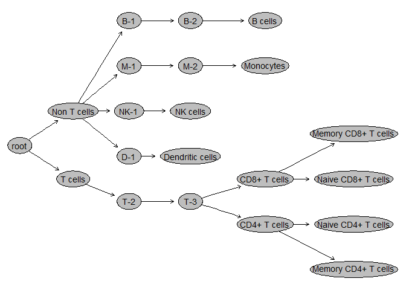

Importing gating hierarchy
================

``` r
library(flowWorkspace)
```

    ## Warning: package 'flowWorkspace' was built under R version 4.0.3

    ## As part of improvements to flowWorkspace, some behavior of
    ## GatingSet objects has changed. For details, please read the section
    ## titled "The cytoframe and cytoset classes" in the package vignette:
    ## 
    ##   vignette("flowWorkspace-Introduction", "flowWorkspace")

``` r
library(CytoML)

#full path of gatingML and fcsfile 
xmlfile <- "C:/Users/rkxor/Documents/R_example/analysis-pipeline/#2Mass/data/CytExp_337288_Gates_v6.xml"
fcsfile <- "C:/Users/rkxor/Documents/R_example/analysis-pipeline/#2Mass/data/2019 1 29  Control_Leukocyte.fcs"
#Get gatingset object from gatingML file and fcs file.
gs <- cytobank_to_gatingset(xmlfile, fcsfile)
```

    ## T cells

    ## Non T cells

    ## T-2

    ## D-1

    ## NK-1

    ## M-1

    ## B-1

    ## T-3

    ## Dendritic cells

    ## NK cells

    ## M-2

    ## B-2

    ## CD4+ T cells

    ## CD8+ T cells

    ## Monocytes

    ## B cells

    ## Memory CD4+ T cells

    ## Naive CD4+ T cells

    ## Naive CD8+ T cells

    ## Memory CD8+ T cells

    ## Warning in compensate(gs, g): Compensation is skipped!Because gates refer to
    ## 'FCS' for compensation but no spillover is found in FCS.

    ## Non T cells

    ## B-1

    ## B-2

    ## B cells

    ## M-1

    ## M-2

    ## Monocytes

    ## NK-1

    ## NK cells

    ## D-1

    ## Dendritic cells

    ## T cells

    ## T-2

    ## T-3

    ## CD8+ T cells

    ## Memory CD8+ T cells

    ## Naive CD8+ T cells

    ## CD4+ T cells

    ## Naive CD4+ T cells

    ## Memory CD4+ T cells

    ## done!

``` r
# Extract the population statistics
gs_pop_get_count_fast(gs, statType = "count")
```

    ##                                 name
    ##  1: 2019 1 29  Control_Leukocyte.fcs
    ##  2: 2019 1 29  Control_Leukocyte.fcs
    ##  3: 2019 1 29  Control_Leukocyte.fcs
    ##  4: 2019 1 29  Control_Leukocyte.fcs
    ##  5: 2019 1 29  Control_Leukocyte.fcs
    ##  6: 2019 1 29  Control_Leukocyte.fcs
    ##  7: 2019 1 29  Control_Leukocyte.fcs
    ##  8: 2019 1 29  Control_Leukocyte.fcs
    ##  9: 2019 1 29  Control_Leukocyte.fcs
    ## 10: 2019 1 29  Control_Leukocyte.fcs
    ## 11: 2019 1 29  Control_Leukocyte.fcs
    ## 12: 2019 1 29  Control_Leukocyte.fcs
    ## 13: 2019 1 29  Control_Leukocyte.fcs
    ## 14: 2019 1 29  Control_Leukocyte.fcs
    ## 15: 2019 1 29  Control_Leukocyte.fcs
    ## 16: 2019 1 29  Control_Leukocyte.fcs
    ## 17: 2019 1 29  Control_Leukocyte.fcs
    ## 18: 2019 1 29  Control_Leukocyte.fcs
    ## 19: 2019 1 29  Control_Leukocyte.fcs
    ## 20: 2019 1 29  Control_Leukocyte.fcs
    ##                                            Population
    ##  1:                                      /Non T cells
    ##  2:                                  /Non T cells/B-1
    ##  3:                              /Non T cells/B-1/B-2
    ##  4:                      /Non T cells/B-1/B-2/B cells
    ##  5:                                  /Non T cells/M-1
    ##  6:                              /Non T cells/M-1/M-2
    ##  7:                    /Non T cells/M-1/M-2/Monocytes
    ##  8:                                 /Non T cells/NK-1
    ##  9:                        /Non T cells/NK-1/NK cells
    ## 10:                                  /Non T cells/D-1
    ## 11:                  /Non T cells/D-1/Dendritic cells
    ## 12:                                          /T cells
    ## 13:                                      /T cells/T-2
    ## 14:                                  /T cells/T-2/T-3
    ## 15:                     /T cells/T-2/T-3/CD8+ T cells
    ## 16: /T cells/T-2/T-3/CD8+ T cells/Memory CD8+ T cells
    ## 17:  /T cells/T-2/T-3/CD8+ T cells/Naive CD8+ T cells
    ## 18:                     /T cells/T-2/T-3/CD4+ T cells
    ## 19:  /T cells/T-2/T-3/CD4+ T cells/Naive CD4+ T cells
    ## 20: /T cells/T-2/T-3/CD4+ T cells/Memory CD4+ T cells
    ##                            Parent  Count ParentCount
    ##  1:                          root  81704      195003
    ##  2:                  /Non T cells  51477       81704
    ##  3:              /Non T cells/B-1  21634       51477
    ##  4:          /Non T cells/B-1/B-2  16278       21634
    ##  5:                  /Non T cells  27887       81704
    ##  6:              /Non T cells/M-1  18830       27887
    ##  7:          /Non T cells/M-1/M-2  17490       18830
    ##  8:                  /Non T cells  39594       81704
    ##  9:             /Non T cells/NK-1  14630       39594
    ## 10:                  /Non T cells  37187       81704
    ## 11:              /Non T cells/D-1   3170       37187
    ## 12:                          root 110927      195003
    ## 13:                      /T cells 103849      110927
    ## 14:                  /T cells/T-2 103561      103849
    ## 15:              /T cells/T-2/T-3  19093      103561
    ## 16: /T cells/T-2/T-3/CD8+ T cells   1121       19093
    ## 17: /T cells/T-2/T-3/CD8+ T cells  16232       19093
    ## 18:              /T cells/T-2/T-3  71985      103561
    ## 19: /T cells/T-2/T-3/CD4+ T cells  47548       71985
    ## 20: /T cells/T-2/T-3/CD4+ T cells  13006       71985

``` r
plot(gs)
```

<!-- -->
