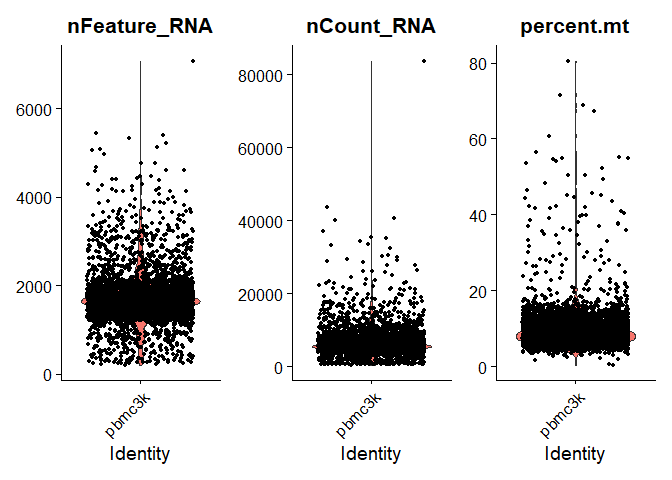
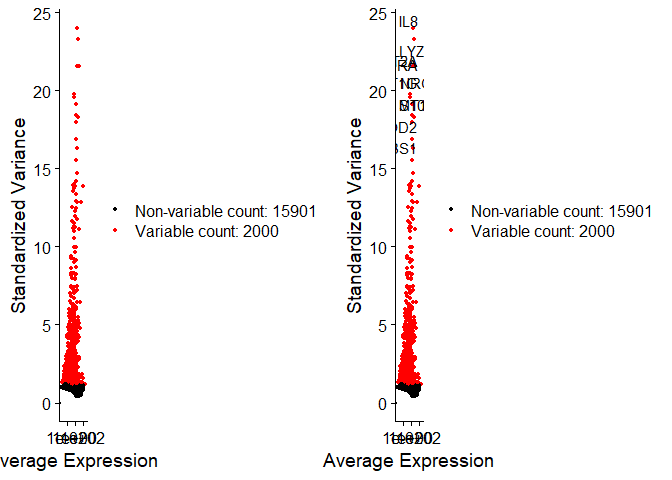
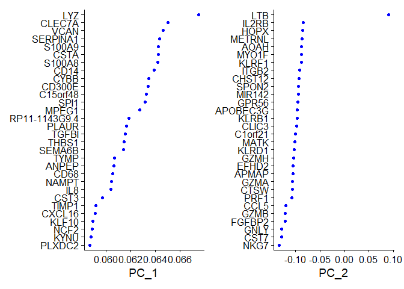
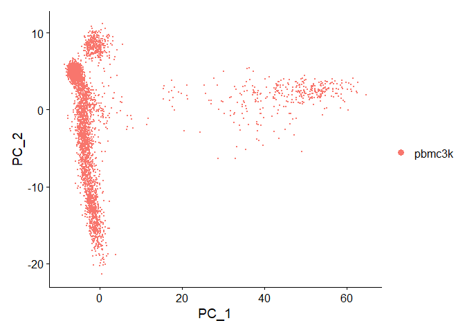
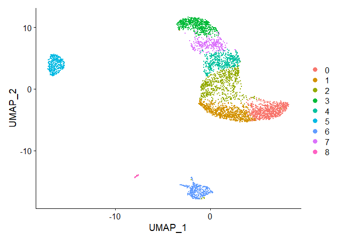
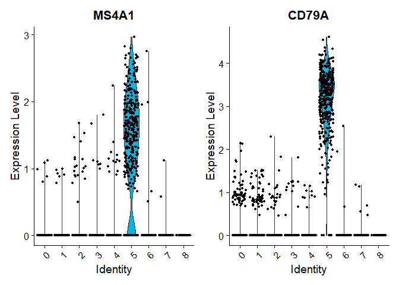
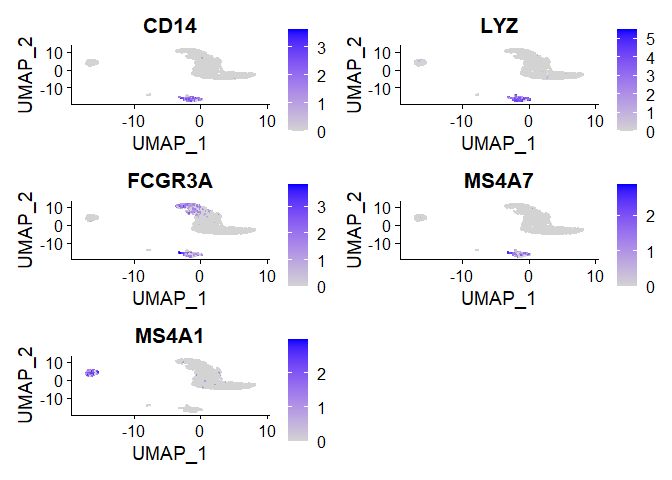
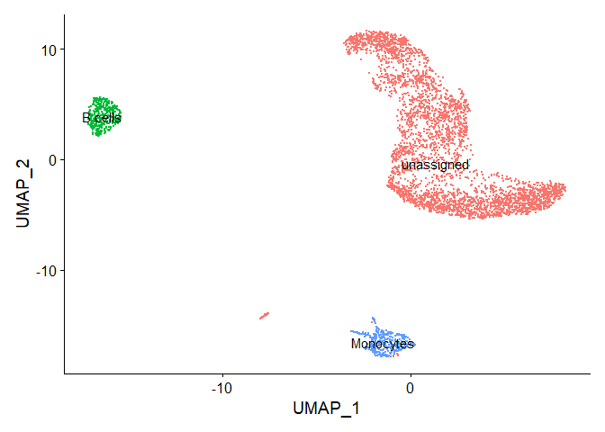

scRNAseq analysis
================

### The example data sets

We use a of single-cell RNA sequencing data from Ha et al. Small(2020).
Treated samples are coated with Ag nano pariticle.We use a preprocessed
sample in CellRanger Software.

### Single-cell RNA sequencing

Single-cell RNA sequencing (scRNA-seq) technologies allow the dissection
of gene expression at single-cell resolution. scRNA-seq techniques can
be divided into full-length and 3’ enrichment (UMI-based) methods. In
theory, UMI-based scRNA-seq can largely reduce the technical noise,
which remarkably benefits the estimation of absolute transcript count
(Islam et al., 2014). This document introduces 10x Genomics’ scRNA-seq
technology and pipeline for preprocessing and analysis of sc-RNAseq data
obtained from 10x Genomics protocol.

### Setup the Seurat Object

##### Load 10X Data

``` r
library(Seurat)
library(dplyr)
```

    ## 
    ## Attaching package: 'dplyr'

    ## The following objects are masked from 'package:stats':
    ## 
    ##     filter, lag

    ## The following objects are masked from 'package:base':
    ## 
    ##     intersect, setdiff, setequal, union

``` r
library(Matrix)
matrix_dir = "../data/filtered_feature_bc_matrix/"
pbmc.data <- Read10X(data.dir = matrix_dir)
dim(pbmc.data)
```

    ## [1] 32738  4542

##### Initialize the Seurat object with the raw (non-normalized data).

``` r
pbmc <- CreateSeuratObject(counts = pbmc.data, project = "pbmc3k", min.cells = 3, min.features = 200)
```

    ## Warning: Feature names cannot have underscores ('_'), replacing with dashes
    ## ('-')

``` r
dim(pbmc)
```

    ## [1] 17901  4507

### Standrd pre-processing workflow

The steps below encompass the standard pre-processing workflow for
scRNA-seq data in Seurat. These represent the selection and filtration
of cells based on QC metrics, data normalization and scaling, and the
detection of highly variable features.

##### QC and selecting cells for further analysis

Seurat allows you to easily explore QC metrics and filter cells based on
any user-defined criteria. A few QC metrics commonly used by the
community include - The number of unique genes detected in each cell. -
Low-quality cells or empty droplets will often have very few genes -
Cell doublets or multiplets may exhibit an aberrantly high gene count -
Similarly, the total number of molecules detected within a cell
(correlates strongly with unique genes) - The percentage of reads that
map to the mitochondrial genome - Low-quality / dying cells often
exhibit extensive mitochondrial contamination - We calculate
mitochondrial QC metrics with the PercentageFeatureSet function, which
calculates the percentage of counts originating from a set of features -
We use the set of all genes starting with MT- as a set of mitochondrial
genes

The \[\[ operator can add columns to object metadata. This is a great
place to stash QC stats

``` r
pbmc[["percent.mt"]] <- PercentageFeatureSet(pbmc, pattern = "^MT-")
VlnPlot(pbmc, features = c("nFeature_RNA", "nCount_RNA", "percent.mt"), ncol = 3)
```

<!-- --> In
the example above, we visualize QC metrics, and use these to filter
cells.

  - We filter cells that have unique feature counts over 4000 or less
    than 200
  - We filter cells that have \>20% mitochondrial counts

<!-- end list -->

``` r
pbmc <- subset(pbmc, subset = nFeature_RNA > 200 & nFeature_RNA < 4000 & percent.mt < 20)
```

##### Normalizing the data

After removing unwanted cells from the dataset, the next step is to
normalize the data. By default, we employ a global-scaling normalization
method “LogNormalize” that normalizes the feature expression
measurements for each cell by the total expression, multiplies this by a
scale factor (10,000 by default), and log-transforms the result.
Normalized values are stored in pbmc\[\[“RNA”\]\]@data.

``` r
pbmc <- NormalizeData(pbmc, normalization.method = "LogNormalize", scale.factor = 10000)
```

##### Identification of highly variable features (feature selection)

We next calculate a subset of features that exhibit high cell-to-cell
variation in the dataset.

``` r
pbmc <- FindVariableFeatures(pbmc, selection.method = "vst", nfeatures = 2000)

# Identify the 10 most highly variable genes
top10 <- head(VariableFeatures(pbmc), 10)

# plot variable features with and without labels
plot1 <- VariableFeaturePlot(pbmc)
plot2 <- LabelPoints(plot = plot1, points = top10, repel = TRUE)
```

    ## When using repel, set xnudge and ynudge to 0 for optimal results

``` r
CombinePlots(plots = list(plot1, plot2))
```

    ## Warning: CombinePlots is being deprecated. Plots should now be combined using
    ## the patchwork system.

    ## Warning: Transformation introduced infinite values in continuous x-axis
    
    ## Warning: Transformation introduced infinite values in continuous x-axis

<!-- -->

##### Scaling the data

Next, we apply a linear transformation (‘scaling’) that is a standard
pre-processing step prior to dimensional reduction techniques like PCA.
The ScaleData function: - Shifts the expression of each gene, so that
the mean expression across cells is 0 - Scales the expression of each
gene, so that the variance across cells is 1 - This step gives equal
weight in downstream analyses, so that highly-expressed genes do not
dominate - The results of this are stored in
pbmc\[\[“RNA”\]\]@scale.data

``` r
all.genes <- rownames(pbmc)
pbmc <- ScaleData(pbmc, features = all.genes)
```

    ## Centering and scaling data matrix

### Perform linear dimensional reduction(PCA)

we perform PCA on the scaled data. By default, only the previously
determined variable features are used as input, but can be defined using
features argument if you wish to choose a different subset.

``` r
pbmc <- RunPCA(pbmc, features = VariableFeatures(object = pbmc))
```

    ## PC_ 1 
    ## Positive:  LYZ, CLEC7A, VCAN, SERPINA1, S100A9, CSTA, S100A8, CD14, CYBB, CD300E 
    ##     C15orf48, SPI1, MPEG1, RP11-1143G9.4, PLAUR, TGFBI, THBS1, SEMA6B, TYMP, ANPEP 
    ##     CD68, NAMPT, IL8, CST3, TIMP1, CXCL16, KLF10, NCF2, KYNU, PLXDC2 
    ## Negative:  MALAT1, RPS18, RPS12, LTB, IL32, IL7R, CCR7, KLF2, LEF1, MAL 
    ##     PRKCQ-AS1, SELL, NELL2, TSHZ2, AQP3, CD27, PASK, RORA, HSP90AB1, CD69 
    ##     DNAJB1, SYNE2, ADTRP, NOG, COL18A1, SESN3, ISG20, CA6, NGFRAP1, CMSS1 
    ## PC_ 2 
    ## Positive:  LTB, CCR7, RPS12, PABPC1, RPS18, SELL, MAL, LEF1, IL7R, TSHZ2 
    ##     CD79A, TSC22D3, ACTN1, SPINT2, PRKCQ-AS1, CD27, MS4A1, NELL2, PASK, LINC00926 
    ##     MYC, AQP3, SOCS3, SESN3, HLA-DQB1, CTSH, TNFAIP8, BANK1, CD37, HLA-DRA 
    ## Negative:  NKG7, CST7, GNLY, FGFBP2, GZMB, CCL5, PRF1, CTSW, GZMA, APMAP 
    ##     EFHD2, GZMH, KLRD1, MATK, C1orf21, CLIC3, KLRB1, APOBEC3G, GPR56, MIR142 
    ##     SPON2, CHST12, ITGB2, KLRF1, MYO1F, AOAH, METRNL, HOPX, IL2RB, SH2D1B 
    ## PC_ 3 
    ## Positive:  SDPR, PF4, NRGN, TUBB1, GNG11, PPBP, CLU, ACRBP, SPARC, TREML1 
    ##     CMTM5, ITGA2B, HIST1H2AC, RGS18, MAP3K7CL, GP9, MYL9, TMEM40, PGRMC1, ESAM 
    ##     PRKAR2B, MMD, CTTN, AC147651.3, PTGS1, PTCRA, SMOX, RUFY1, MARCH2, MTURN 
    ## Negative:  MALAT1, RPS12, RPS18, LAPTM5, PABPC1, CD44, VIM, KLF6, NFKBIA, HSP90AA1 
    ##     NEAT1, ARL4C, CD37, EIF4A1, JUN, MT-ND1, S100A6, IRF1, ZFP36L1, JUNB 
    ##     EIF1, TNFAIP3, SEC61B, KLF2, ARPC3, HSP90AB1, CALR, S100A10, DAZAP2, IL32 
    ## PC_ 4 
    ## Positive:  IL7R, VIM, S100A10, IL32, LEF1, MAL, PRKCQ-AS1, PABPC1, ACTN1, AQP3 
    ##     NELL2, TSHZ2, SELL, RGCC, DNAJB1, CD27, S100A11, LTB, CTSL, SAMHD1 
    ##     ARL4C, ADTRP, CCR7, NGFRAP1, MT1X, NOG, RPS12, ACTG1, AIF1, SOCS3 
    ## Negative:  CD79A, MS4A1, HLA-DQA2, CD74, LINC00926, CD79B, HLA-DQB1, HLA-DRB5, HLA-DRB1, ADAM28 
    ##     CD40, BANK1, TCF4, HLA-DPA1, HLA-DPB1, CHPT1, HLA-DRA, TSPAN33, IGLL5, ARHGAP24 
    ##     COBLL1, HLA-DQA1, CTA-250D10.23, BLK, TNFRSF13C, CD83, CTSH, HLA-DMB, KIAA0226L, IRF8 
    ## PC_ 5 
    ## Positive:  SH2D1B, CD38, SPON2, PLAC8, IGFBP7, TYROBP, PRSS23, ITGB2, GPR56, PRF1 
    ##     SELL, FCGR3A, MAL, CCR7, KLRF1, LEF1, TTC38, ACTN1, GZMB, RAMP1 
    ##     KRT86, FCER1G, LAT2, RHOBTB3, AOAH, KRT81, FGFBP2, IFITM3, NOG, PRKCQ-AS1 
    ## Negative:  PPP1R14B, CXCR3, GZMK, FAM129A, LYAR, GAPDH, FTH1, DUSP4, CD44, SLC7A5 
    ##     CD82, PERP, NXPH4, ITM2C, TNFAIP3, APOBEC3G, RORA, MIAT, DFNB31, MT-ND1 
    ##     PHACTR2, ST8SIA1, TPRG1, JUN, KLF6, KLRG1, CD84, ANXA1, VIM, S100A11

``` r
VizDimLoadings(pbmc, dims = 1:2, reduction = "pca")
```

<!-- -->

``` r
DimPlot(pbmc, reduction = "pca")
```

<!-- -->

### Cluster the cells

Seurat v3 applies a graph-based clustering approach, building upon
initial strategies in (Macosko et al). As in PhenoGraph, we first
construct a KNN graph based on the euclidean distance in PCA space, and
refine the edge weights between any two cells based on the shared
overlap in their local neighborhoods (Jaccard similarity). This step is
performed using the FindNeighbors function, and takes as input the
previously defined dimensionality of the dataset (first 10 PCs).To
cluster the cells, we next apply modularity optimization techniques such
as the Louvain algorithm (default) or SLM \[SLM, Blondel et al., Journal
of Statistical Mechanics\], to iteratively group cells together, with
the goal of optimizing the standard modularity function. The
FindClusters function implements this procedure, and contains a
resolution parameter that sets the ‘granularity’ of the downstream
clustering, with increased values leading to a greater number of
clusters. The clusters can be found using the Idents function.

``` r
pbmc <- FindNeighbors(pbmc, dims = 1:10)
```

    ## Computing nearest neighbor graph

    ## Computing SNN

``` r
pbmc <- FindClusters(pbmc, resolution = 0.5)
```

    ## Modularity Optimizer version 1.3.0 by Ludo Waltman and Nees Jan van Eck
    ## 
    ## Number of nodes: 4366
    ## Number of edges: 157695
    ## 
    ## Running Louvain algorithm...
    ## Maximum modularity in 10 random starts: 0.8959
    ## Number of communities: 9
    ## Elapsed time: 0 seconds

``` r
head(Idents(pbmc), 5)
```

    ## AAACCCAGTCAGACTT-1 AAACCCATCGAGTACT-1 AAACGAAAGAGCAGCT-1 AAACGAAAGGCAGTCA-1 
    ##                  2                  6                  0                  1 
    ## AAACGAACACTTGGCG-1 
    ##                  4 
    ## Levels: 0 1 2 3 4 5 6 7 8

### Run non-linear dimensional reduction (UMAP/tSNE)

Seurat offers several non-linear dimensional reduction techniques, such
as tSNE and UMAP, to visualize and explore these datasets. The goal of
these algorithms is to learn the underlying manifold of the data in
order to place similar cells together in low-dimensional space.

``` r
pbmc <- RunUMAP(pbmc, dims = 1:10)
```

    ## Warning: The default method for RunUMAP has changed from calling Python UMAP via reticulate to the R-native UWOT using the cosine metric
    ## To use Python UMAP via reticulate, set umap.method to 'umap-learn' and metric to 'correlation'
    ## This message will be shown once per session

    ## 22:14:48 UMAP embedding parameters a = 0.9922 b = 1.112

    ## 22:14:48 Read 4366 rows and found 10 numeric columns

    ## 22:14:48 Using Annoy for neighbor search, n_neighbors = 30

    ## 22:14:48 Building Annoy index with metric = cosine, n_trees = 50

    ## 0%   10   20   30   40   50   60   70   80   90   100%

    ## [----|----|----|----|----|----|----|----|----|----|

    ## **************************************************|
    ## 22:14:49 Writing NN index file to temp file C:\Users\admin\AppData\Local\Temp\RtmpWQbk2j\file5d503fba7e1
    ## 22:14:49 Searching Annoy index using 1 thread, search_k = 3000
    ## 22:14:50 Annoy recall = 100%
    ## 22:14:50 Commencing smooth kNN distance calibration using 1 thread
    ## 22:14:51 Initializing from normalized Laplacian + noise
    ## 22:14:51 Commencing optimization for 500 epochs, with 178498 positive edges
    ## 22:15:04 Optimization finished

``` r
DimPlot(pbmc, reduction = "umap")
```

<!-- -->
\#\#\# Finding differentially expressed features Seurat can help you
find markers that define clusters via differential expression. By
default, it identifes positive and negative markers of a single cluster
(specified in ident.1), compared to all other cells. FindAllMarkers
automates this process for all clusters, but you can also test groups of
clusters vs. each other, or against all cells. The min.pct argument
requires a feature to be detected at a minimum percentage in either of
the two groups of cells.

``` r
# find all markers of cluster 1
cluster1.markers<-FindMarkers(pbmc, ident.1=1, min.pct=0.25)
head(cluster1.markers, n=5)
```

    ##               p_val avg_log2FC pct.1 pct.2     p_val_adj
    ## SELL  4.149994e-243  1.2726568 0.843 0.246 7.428903e-239
    ## CCR7  8.811471e-224  1.3659217 0.898 0.350 1.577341e-219
    ## LTB   1.235488e-191  1.2192391 0.981 0.529 2.211648e-187
    ## RPL32 7.829704e-189  0.6520091 1.000 0.989 1.401595e-184
    ## RPS3A 2.211679e-183  0.5987050 1.000 0.990 3.959127e-179

``` r
# find all markers distinguishing cluster 5 from clusters 0 and 3
cluster5.markers <- FindMarkers(pbmc, ident.1 = 5, ident.2 = c(0, 3), min.pct = 0.25)
head(cluster5.markers, n = 5)
```

    ##                  p_val avg_log2FC pct.1 pct.2     p_val_adj
    ## HLA-DRA   0.000000e+00   5.110065 1.000 0.078  0.000000e+00
    ## HLA-DQB1  0.000000e+00   3.909552 0.981 0.033  0.000000e+00
    ## HLA-DQA2  0.000000e+00   2.960478 0.938 0.016  0.000000e+00
    ## CD79A     0.000000e+00   4.678313 0.981 0.052  0.000000e+00
    ## HLA-DRB1 7.209303e-305   4.007060 0.987 0.077 1.290537e-300

``` r
# find markers for every cluster compared to all remaining cells, report only the positive ones
pbmc.markers <- FindAllMarkers(pbmc, only.pos=T, min.pct = 0.25, logfc.threshold = 0.25)
```

    ## Calculating cluster 0

    ## Calculating cluster 1

    ## Calculating cluster 2

    ## Calculating cluster 3

    ## Calculating cluster 4

    ## Calculating cluster 5

    ## Calculating cluster 6

    ## Calculating cluster 7

    ## Calculating cluster 8

``` r
pbmc.markers %>% group_by(cluster) %>% top_n(n=2, wt = avg_log2FC)
```

    ## Registered S3 method overwritten by 'cli':
    ##   method     from    
    ##   print.boxx spatstat

    ## # A tibble: 18 x 7
    ## # Groups:   cluster [9]
    ##        p_val avg_log2FC pct.1 pct.2 p_val_adj cluster gene    
    ##        <dbl>      <dbl> <dbl> <dbl>     <dbl> <fct>   <chr>   
    ##  1 4.61e-179      1.02  0.662 0.187 8.24e-175 0       MAL     
    ##  2 6.25e-177      0.899 0.963 0.572 1.12e-172 0       RGS10   
    ##  3 4.15e-243      1.27  0.843 0.246 7.43e-239 1       SELL    
    ##  4 8.81e-224      1.37  0.898 0.35  1.58e-219 1       CCR7    
    ##  5 3.25e- 61      0.817 0.871 0.513 5.82e- 57 2       IL7R    
    ##  6 6.35e-  7      0.830 0.32  0.243 1.14e-  2 2       FOS     
    ##  7 0.             3.34  0.97  0.165 0.        3       FGFBP2  
    ##  8 0.             3.18  0.995 0.297 0.        3       GNLY    
    ##  9 1.23e-159      1.85  0.886 0.416 2.20e-155 4       PPP1R14B
    ## 10 4.30e-159      1.32  0.46  0.063 7.69e-155 4       GZMK    
    ## 11 0.             4.71  0.981 0.042 0.        5       CD79A   
    ## 12 0.             3.96  0.495 0.004 0.        5       IGLL5   
    ## 13 0.             5.66  0.983 0.025 0.        6       LYZ     
    ## 14 0.             4.74  0.894 0.03  0.        6       IL8     
    ## 15 3.43e-178      2.14  0.843 0.187 6.15e-174 7       GZMH    
    ## 16 2.50e-151      2.05  0.981 0.391 4.48e-147 7       CCL5    
    ## 17 0.             7.42  1     0.014 0.        8       PF4     
    ## 18 8.67e-177      8.23  1     0.041 1.55e-172 8       NRGN

We include several tools for visualizing marker expression. VlnPlot
(shows expression probability distributions across clusters), and
FeaturePlot (visualizes feature expression on a tSNE or PCA plot) are
our most commonly used visualizations.

``` r
VlnPlot(pbmc, features = c("MS4A1", "CD79A"))
```

<!-- -->

``` r
FeaturePlot(pbmc, features = c("CD14", "LYZ", "FCGR3A", "MS4A7", "MS4A1"))
```

<!-- -->

### Assigning cell type identity to clusters

In the case of this dataset, we can use canonical markers to easily
match the unbiased clustering to known cell types(B cells : MS4A1,
Monocytes: CD14, LYZ, FCGR3A, MS4A7)

``` r
new.cluster.ids <- c("unassigned", "unassigned", "unassigned", "unassigned", "unassigned", "B cells", "Monocytes", "unassigned", "unassigned")
names(new.cluster.ids) <- levels(pbmc)
pbmc <- RenameIdents(pbmc, new.cluster.ids)
DimPlot(pbmc, reduction = "umap", label = TRUE, pt.size = 0.5) + NoLegend()
```

<!-- -->

### References

  - My Kieu Ha (2020). Mass Cytometry and Single‐Cell RNA‐seq Profiling
    of the Heterogeneity in Human Peripheral Blood Mononuclear Cells
    Interacting with Silver Nanoparticles. Small, Volume 16, Issue 21.
    <doi:10.1002/smll.201907674>
  - Seurat - Guided Clustering Tutorial, SATIJA LAB,
    <https://satijalab.org/seurat/v3.2/pbmc3k_tutorial.html>
